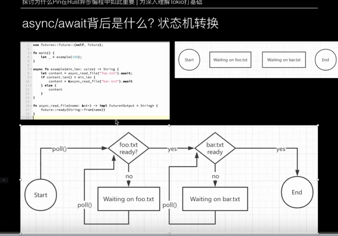

## 一 Send 和 Sync
### 1.1 什么是Send
* Send表示值或者所有权可以在线程之间安全传递
* 只有实现了Send的数据结构或者类型才可以在线程之间安全传递
* 几乎所有基本类型，比如i32、f64、String等都自动实现了 Send
* 不安全类型如原始指针(*const T、*mut T)默认不实现Send，因为它们的访问没有保证线程安全

### 1.2 什么是Sync
* Sync表示值或者所有权可以在线程之间安全共享
* 只有实现了Sync，才可以安全地在多线程中使用其共享引用(&T)
* Rust中的 &T 是只读的，因此在多个线程中共享 &T 是线程安全的
* 基本类型如i32、f64 等以及线程安全类型如Arc<T>、Mutex<T>默认实现了 Sync
* 原始指针(*const T、*mut T)默认不实现 Sync，因为它们的引用可能不是线程安全的

### 1.3 Send 和 Sync比较
**作用**
- Send: 类型值可以在线程之间移动
- Sync: 类型的引用可以在多个线程中共享

**关键点**
- Send: 表示所有权的传递是线程安全的
- Sync: 表示共享引用的访问是线程安全的

**实现场景**
- Send: 适用于跨线程传递数据的场景
- Sync: 适用于跨线程共享数据的场景

**自动实现**
- Send: 基本类型默认实现
- Sync: 基本类型默认实现

## 2 理解 Rust Future
### 2.1 什么是Future
Future 是一个核心概念，它表示一个异步操作的结果或任务  
Future 是一个 trait，定义在 std::future 模块中。它描述了一个异步操作的行为和结果
```rust
pub trait Future {
    type Output;
    fn poll(self: Pin<&mut Self>, cx: &mut Context<'_>) -> Poll<Self::Output>;
}
```
Output: 表示异步任务完成时返回的结果类型
poll 方法: 用于检查 Future 是否已完成。如果完成，返回 Poll::Ready(Output)；否则返回 Poll::Pending
当然，和java中Future.get()不一样，rust中poll不是阻塞，就是会立即返回状态有没有完成，因此想要等待Future准备的数据好了程序再往下执行，就需要自己来处理了  
调用
### 2.2 Future 的工作原理
Rust 的异步编程基于协作式调度（Cooperative Scheduling），这意味着：
Future 本身不主动执行，而是通过异步运行时（如 Tokio 或 async-std）驱动。
poll 是核心机制，运行时会反复调用它，直到 Future 完成

poll 的流程
运行时调用 poll 检查 Future 是否完成。
如果返回 Poll::Pending，表示任务还未完成，运行时会挂起任务并等待通知。
如果返回 Poll::Ready(Output)，表示任务完成，运行时获取结果并停止轮询。

### 2.3 async/await 与 Future 的关系
在实际开发中，直接实现 Future 是繁琐的。Rust 提供了 async/await 语法糖，大幅简化了异步编程  
async 函数生成 Future
任何标记为 async 的函数，实际上返回一个实现了 Future 的匿名类型:
```rust
async fn async_task() -> u32 {
    42
}
```
等价于：  
```rust
fn async_task() -> impl Future<Output = u32> {
    async { 42 }
}
```

await 驱动 Future
await 是对 poll 的封装，允许异步任务按序执行:  
```rust
async fn main_task() {
    let result = async_task().await;
    println!("Result: {}", result);
}
```
await 会将 Future 交给运行时驱动，挂起当前任务，直到 Future 完成  

### 2.4 Future 的链式组合
通过 .then、.map 或 async/await 可以轻松组合多个 Future，形成任务链
使用 .map 组合:  
```rust
use futures::future;

fn main() {
    let future1 = future::ready(10);
    let future2 = future1.map(|x| x * 2);

    let result = futures::executor::block_on(future2);
    println!("Result: {}", result); // Output: 20
}
```

使用 async/await:  
```rust
async fn add(x: u32, y: u32) -> u32 {
    x + y
}

async fn main_task() {
    let result = add(5, 10).await;
    println!("Sum: {}", result);
}
```
## 3 理解Rust async await 原理



执行原理
async 关键字的作用:

当一个函数或代码块被标记为 async 后，它实际上不会立即执行，而是返回一个实现了 Future 特征的对象。
这个 Future 对象描述了异步操作的执行过程。
await 的作用:

当 await 被调用时，它会尝试从 Future 中提取结果。如果当前操作还没有完成，await 会让出当前线程的控制权，让其他任务继续运行。
一旦操作完成，await 会恢复执行。
状态机生成:

编译器会将 async 代码块转换为一个基于枚举的状态机。
每个 await 对应状态机中的一个状态，描述了当前的异步操作进度。
状态机通过调用 poll 方法反复检查是否准备好继续执行，并在准备好后切换到下一个状态。
状态转移:

在运行时，任务的调度器会调用 poll 方法来推进状态机，直到完成所有任务。